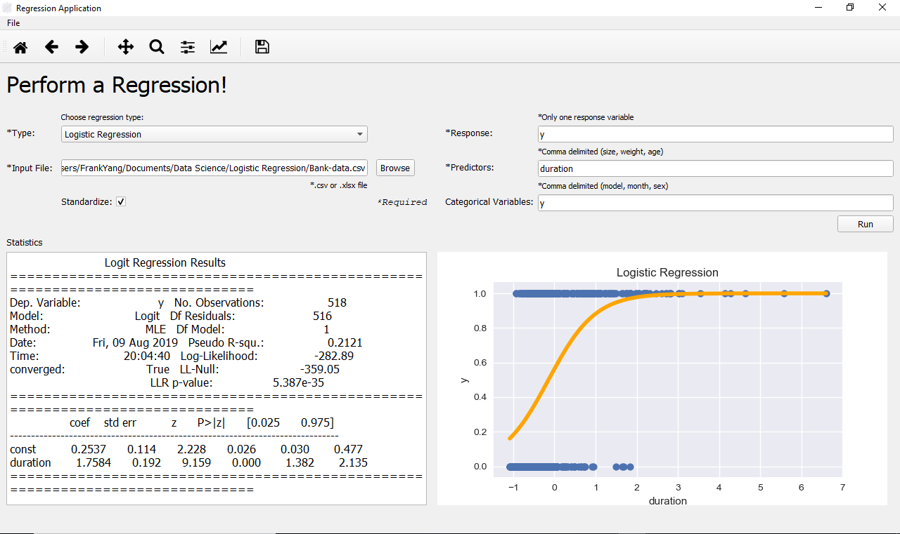

# Regression Application
A Python GUI app developed using PyQt5 software. Uses statsmodels to perform different types of regressions such as Linear, Logistic, Polynomial, and ElasticNet from a user inputted .csv or .xlsx file and matplotlib to visualize the regression by plotting the data and regression line. Prior to performing the regression, a preprocessing procedure is conducted on the raw data. User friendly UI that is easy to use and pleasant to look at.

## Dependencies
- PyQt5
- seaborn
- pandas
- numpy
- sklearn
- matplotlib

